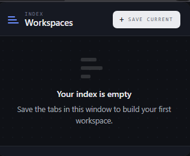

# Workspace Launcher

A Chrome extension that saves groups of open tabs as named workspaces and reopens the whole set with one click.

## Features

- Save all open tabs in the current window as a named workspace
- Optionally exclude specific tabs before saving
- Open a workspace to relaunch every saved tab at once
- Delete workspaces with confirmation
- Fully local — no accounts, no sync, no external services

## Screenshots



## Installation

1. Clone this repo
   ```bash
   git clone https://github.com/Zeyad-101/Workspace-extinsion.git
   ```
2. Open `chrome://extensions` in Chrome
3. Enable **Developer mode** (top right)
4. Click **Load unpacked** and select the cloned folder
5. Pin the extension from the toolbar

## Usage

- Open the tabs you want to group together
- Click the extension icon → **Save current**
- Name the workspace, optionally exclude tabs you don't want included
- Reopen it anytime by clicking its **Open** button in the popup

## Tech Stack

- Vanilla JavaScript, HTML, CSS
- Chrome Extension Manifest V3
- `chrome.storage.local` for persistence
- `chrome.tabs` API for reading and creating tabs

## Data Model

```js
{
  id,
  name,
  createdAt,
  updatedAt,
  tabs: [{ url, title }]
}
```

## License

MIT
